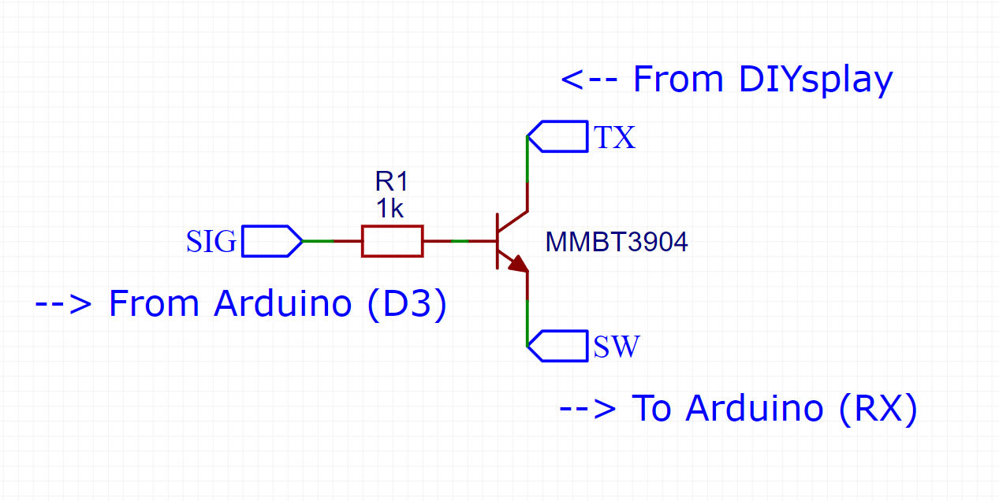

# DIYsplay
DIYsplay is a simple LCD screen module that makes it easy to display information on over 70 different screens.

## Getting Started
You'll first need to connect the DIYsplay to your Arduino board, which needs four data pins and two power pins. For a basic connection, we recommend these pins:

|               | Arduino Pin |   | DIYsplay Pin |
|---------------|-------------|---|--------------|
| **5V Power**  | 5V          | → | 5V           |
| **Ground**    | GND         | → | G            |
| **Sig Pin**   | D3 (Pin 3)  | → | SIG          |
| **Reset Pin** | D4 (Pin 4)  | → | RES          |
| **RX Line**   | D5 (Pin 5)  | → | SW           |
| **TX Line**   | D6 (Pin 6)  | → | RX           |

If you've made sure everything is in the right spot, feel free to turn on your Arduino and ensure that the DIYsplay logo appears on the DIYsplay. Great, let's write some code!

## Basic Usage
> This guide assumes you have the Arduino IDE installed on your computer.

DIYsplay has been built to make displaying your information of choice as simple as possible. To install the required Arduino library, head to ```Tools > Manage Libraries``` and search for ```DIYsplay``` in the Arduino IDE library manager. Click ```Install``` and click ```Yes``` if the Arduino IDE asks if you want to install dependency libraries.

And boom! The code libraries you need are installed. Now time to set up a basic screen. You can follow this code guide, or you can experiment with our pre-made examples in ```File > Examples > DIYsplay```.

Before switching between the screens and changing the widgets displayed on them, you will need to include the DIYsplay library and initialise a DIYsplay object within your code. These lines of code should be at the top of your file:

```C++
#include "DIYsplay.h"

DIYsplay diysplay = DIYsplay();
```
This code includes all of the code needed to run the DIYsplay, and starts up an 'instance' of the DIYsplay so it can be accessed by our code. It assumes you've connected the physical pins as [above](#getting-started). See the [Display Communication](#display-communication) section if you're using a different layout.

Great, all we need to do is put this code into our ```setup()``` function like this:

```C++
void setup() {
    diysplay.begin();
}
```

You will notice in our examples we also have other code in our ```setup()``` function. Depending on the project, this function is also used for setting pin assignments, starting up other sensors and so forth.

We just want to set a simple clock display, so we can update our ```setup()``` function like this:
```C++
void setup() {
    diysplay.begin();
    diysplay.setScreen(DIGITAL_CLOCK);
}
```
The ```DIGITAL_CLOCK``` text can be replaced with whatever screen you want to display on the DIYsplay. A full list can be found on the [Screens](screens.md) page, which also includes previews and how to use each one.

Okay, let's display a time on the screen. To begin with, lets just put a single time on the screen. It won't count, but it's a start.
```C++
void setup() {
    diysplay.begin();
    diysplay.setScreen(DIGITAL_CLOCK);
    diysplay.setData(0,4);
    diysplay.setData(1,30);
}
```

The last two lines of code use the ```setData()``` function to update data on the current screen. The first number in the brackets is the 'index' of the widget we want to change. Some pages have 1 or 2 widgets, while some have more than 10. Again, full information about these can all be found on the [Screens](screens.md) page. If a page has one or more widget, it's first widget will have an index of 0, then the second will have an index of 1, and so forth.

In this case, we're modifying the first widget (Index 0) and and second widget (Index 1) to display ```4``` and ```30``` respectively. There we go, we're now displaying ```4:30``` on the screen. Assuming your Arduino is connected, just hit the Upload button and you're good to go.

The following sections of this guide delve into some more detailed parts of the library, which you may wish to explore if you're more confident with Arduino boards. If not, feel free to explore other samples from the Arduino IDE by navigating to  ```File > Examples > DIYsplay```.

## Display Communication

### Serial Lines
The most popular Arduino-compatible boards (the Uno and the Nano), along with many others, have one primary hardware Serial line, of which messages can be printed to it with ```Serial.println("Hello world!");``` On the Arduino Uno, this is on Pin 0 (RX) and Pin 1 (TX).

The DIYsplay library _CAN_ be configured to use this line to talk to the DIYsplay. This does work, however bear in mind that **any serial commands received or sent on that line will be shared with the DIYsplay**. You may see some weird characters in the Serial console when a DIYsplay function is called. You may also inadvertently send a valid command to the DIYsplay, causing unexpected behaviour.

**So, the DIYsplay library uses the ```SoftwareSerial``` library by default on pins D5 and D6.** To use the HardwareSerial line instead (such as if you have a ATMega2560 board with multiple hardware serial lines), just call ```diysplay.begin(Serial)``` for the first line, ```diysplay.begin(Serial1)``` for the second line and so forth. This is beneficial if you do have spare serial lines to use as they have increased performance. Further information about custom pinouts can be found [below](#custom-pinouts).

### Pin Connections

The DIYsplay uses **four pins total** for communication. Alongside the regular set of RX and TX pins, DIYsplay also includes some other pins on the board to help with communciation. Not all have to be used, however it may make your life easier.

| Pin Number | Pin Name | Description |
| - | - | - |
| 1, 9 | Ground | Circuit Ground. Connect to any reliable ground pin on your Arduino or within your circuit.
| 2 | DTR | Data Terminal Ready. The average DIYsplay user should not need to worry about this pin, but if you are planning on uploading custom firmware to the DIYsplay ensure that this pin is connected to the programming board.
| 3 | SIG | The SIG pin is connected to the base of a transistor that either connects or disconnects the signal on the TX pin. See the pin below for a more detailed description of this functionality.
| 4 | SW | The SW pin is connected to the emitter of the aforementioned transistor. The purpose of this is to **prevent the serial line being controlled by the DIYsplay while the Arduino is being programmed**. More info can be found in the [Transistor Switching](#transistor-switching) section.
| 5, 6 | +5V | Circuit +5V. **3.3V also may work** depending on your configuration of communication pins.
| 7 | TX | TX line on the DIYsplay.
| 8 | RX | RX line on the DIYsplay.
| 10 | RES | Reset line - this pin is important to be connected regardless of your configuration. When low, it prevents the DIYsplay from turning on. Once brought high again, it turns on the DIYsplay and will sync the communication once it starts.

### Transistor Switching
On the Hardware Serial line of the very common Arduino Nano or Uno, Pins 0 (RX) and 1 (TX) are directly connected to the Serial line responsible for programming the chip.

The TX line on the Arduino is fine to use, which is why we connect it directly to the RX pin on the DIYsplay. Since the Arduino's chip is the only driver of this pin, the DIYsplay doesn't care what state it's in until it's actually time to display some screens after bootup.

The RX pin on the Arduino, however, is a different story. It is the only pin which receives data from the host computer or programming board, so if communication is interrupted, programming fails consistently. The bottom line is if we connect the DIYsplay's TX pin directly to the Arduino's RX pin, the DIYsplay's processor will either *forcefully pullup or pulldown the line, preventing programming of the Arduino*.

Our solution to this is adding a small transistor between the RX pin on the Arduino and the TX pin on the DIYsplay processor. This transistor is controlled by the SIG pin, which is handled by the DIYsplay library automatically - it simply turns the pin on when the Arduino is ready to communicate with the DIYsplay.



For sake of customisability, we've broken out the all three of the pins above on the DIYsplays 10 pin header. This may be convienient if you don't need to use this transistor arrangement for some reason, or if you want to optimise the pin usage.

In fact, technically speaking, we don't need to use the transistor arrangement for the current implementation of the DIYsplay library either. We recently swapped to using the SoftwareSerial library for sake of convenience, so the inbuilt hardware Serial line should no longer interfere.

The reason why we still recommend using this setup for beginners is for the simple reason that some boards may not have the hardware or software capability to run a SoftwareSerial line without additional headaches. In any case, if you want to talk to the DIYsplay with just three pins instead of four, and you're not concerned about Serial line interference, then use the below pinout. This should work fine for both Hardware and Software Serial, however testing will be required depending on your configuration.

### Alternative 3-Pin Connection Table

|               | Arduino Pin |   | DIYsplay Pin |
|---------------|-------------|---|--------------|
| **5V Power**  | 5V          | → | 5V           |
| **Ground**    | GND         | → | G            |
| **Reset Pin** | D4 (Pin 4)  | → | RES          |
| **RX Line**   | D5 (Pin 5)  | → | TX           |
| **TX Line**   | D6 (Pin 6)  | → | RX           |


## Advanced Usage
> This section is still a work in progress. Information will be provided in future about how to program the DIYsplay firmware with your own screens.

### Library Structure
The DIYsplay library is a wrapper for the MatesController library, which handles the underlying serial commands. This means that DIYsplay needs the "MatesController" library as a dependency.


### Custom Pinouts
DIYsplay supports customizing all pins used for the hardware interface. We have included multiple constructors for default pinouts, or changing them to a custom configuration. Note that we have not tested using every pin on every Arduino-compatible board, so we cannot guarantee full compatibility with all setups.


#### Software Serial
The standard function that is called by default, even if no arguments are passed in (via another overload with no parameters). It assumes you are using Pin 5 and Pin 6 for the Software Serial configuration. You need to pass in a SoftwareSerial instance that has already been initialized.
```C++
void begin(SoftwareSerial serial, uint8_t sigPin = 3, uint8_t resetPin = 4);
```
You can also just pass in what pins you want to use and let the library initialize the Software Serial interface for you:
```C++
void begin(uint8_t rxPin, uint8_t txPin, uint8_t sigPin = 3, uint8_t resetPin = 4);
```

#### Hardware Serial
If you have a board with additional serial lines such as an Arduino Mega, it is suggested to use Hardware Serial like this instead.
```C++
void begin(HardwareSerial serial, uint8_t sigPin = 3, uint8_t resetPin = 4);
```

#### AltSoftSerial
DIYsplay is fully compatible with the AltSoftSerial library, which if you have multiple Serial lines could make life easier. If you're interested in doing this, you probably already know what you're doing. You'll just need to do the following:

1. Download **AltSoftSerial** from the Arduino Library Manager (or whatever library manager you are using).
2. Open the **DIYsplay.h** header file in the library and **uncomment** this #include line:
```C++
//Please UNCOMMENT this line if you wish to use AltSoftSerial.
//#include "AltSoftSerial.h"
```
After that, everything should be good to go! Just call the begin() method as usual.
```C++
void begin(AltSoftSerial serial, uint8_t sigPin = 3, uint8_t resetPin = 4);
```
### Custom Display Firmware
If you want to take DIYsplay one step further, you can program your own firmware onto it. This allows you to choose exactly what screens you want onto it, and even make your own. We did it ourselves to make the pre-loaded DIYsplay firmware that comes with every DIYsplay.

**Please note that once you have programmed your own firmware onto the DIYsplay, the setScreen() and setData() functions may not function as expected.** These functions operate on specific bindings that will break once the order or selection of screens have changed. It's nothing permanent - you can just re-program our default firmware in any case and go back to factory configuration.

### Contributing
This code isn't perfect. There are plenty of bugfixes and optimisations that could be made in this library. If you'd like to contribute, feel free to fork this library and create a pull request with your changes.