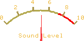

| Image Preview | Name |
| ------------- | ---- |
|<center>**Page 0**</center><br>|**DIYSPLAY_LOGO**<br>*Change to this page with:* ```diysplay.setScreen(DIYSPLAY_LOGO);```<br><br>
|<center>**Page 1**</center><br>|**_5_GAUGE_EQ**<br>*Change to this page with:* ```diysplay.setScreen(_5_GAUGE_EQ);```<br><br>&nbsp;**LedSpectrum0** (Col 1): ```diysplay.setData(0, VALUE);```&nbsp;&nbsp;*[Range: 100]*<br><br>**LedSpectrum0** (Col 2): ```diysplay.setData(1, VALUE);```&nbsp;&nbsp;*[Range: 100]*<br><br>**LedSpectrum0** (Col 3): ```diysplay.setData(2, VALUE);```&nbsp;&nbsp;*[Range: 100]*<br><br>**LedSpectrum0** (Col 4): ```diysplay.setData(3, VALUE);```&nbsp;&nbsp;*[Range: 100]*<br><br>**LedSpectrum0** (Col 5): ```diysplay.setData(4, VALUE);```&nbsp;&nbsp;*[Range: 100]*<br><br>
|<center>**Page 2**</center><br>|**BAR_METER_LEDDIGITS**<br>*Change to this page with:* ```diysplay.setScreen(BAR_METER_LEDDIGITS);```<br><br>&nbsp;&nbsp;&nbsp;**LedDigits0**: ```diysplay.setData(0, VALUE);```<br><br>&nbsp;&nbsp;&nbsp;**LedDigits1**: ```diysplay.setData(1, VALUE);```<br><br>&nbsp;&nbsp;&nbsp;**LedDigits2**: ```diysplay.setData(2, VALUE);```<br><br>&nbsp;&nbsp;&nbsp;**LedDigits3**: ```diysplay.setData(3, VALUE);```<br><br>&nbsp;&nbsp;&nbsp;**LedDigits4**: ```diysplay.setData(4, VALUE);```<br><br>&nbsp;**LedSpectrum1** (Col 1): ```diysplay.setData(5, VALUE);```&nbsp;&nbsp;*[Range: 100]*<br><br>**LedSpectrum1** (Col 2): ```diysplay.setData(6, VALUE);```&nbsp;&nbsp;*[Range: 100]*<br><br>**LedSpectrum1** (Col 3): ```diysplay.setData(7, VALUE);```&nbsp;&nbsp;*[Range: 100]*<br><br>**LedSpectrum1** (Col 4): ```diysplay.setData(8, VALUE);```&nbsp;&nbsp;*[Range: 100]*<br><br>**LedSpectrum1** (Col 5): ```diysplay.setData(9, VALUE);```&nbsp;&nbsp;*[Range: 100]*<br><br>
|<center>**Page 3**</center><br>|**LCD_BAR_METER**<br>*Change to this page with:* ```diysplay.setScreen(LCD_BAR_METER);```<br><br>&nbsp;**LedSpectrum2** (Col 1): ```diysplay.setData(0, VALUE);```&nbsp;&nbsp;*[Range: 100]*<br><br>**LedSpectrum2** (Col 2): ```diysplay.setData(1, VALUE);```&nbsp;&nbsp;*[Range: 100]*<br><br>**LedSpectrum2** (Col 3): ```diysplay.setData(2, VALUE);```&nbsp;&nbsp;*[Range: 100]*<br><br>**LedSpectrum2** (Col 4): ```diysplay.setData(3, VALUE);```&nbsp;&nbsp;*[Range: 100]*<br><br>**LedSpectrum2** (Col 5): ```diysplay.setData(4, VALUE);```&nbsp;&nbsp;*[Range: 100]*<br><br>
|<center>**Page 4**</center><br>|**MEDIA_SPECTRUM_L_TO_R**<br>*Change to this page with:* ```diysplay.setScreen(MEDIA_SPECTRUM_L_TO_R);```<br><br>&nbsp;**MediaSpectrum0** (Col 1): ```diysplay.setData(0, VALUE);```&nbsp;&nbsp;*[Range: 100]*<br><br>**MediaSpectrum0** (Col 2): ```diysplay.setData(1, VALUE);```&nbsp;&nbsp;*[Range: 100]*<br><br>**MediaSpectrum0** (Col 3): ```diysplay.setData(2, VALUE);```&nbsp;&nbsp;*[Range: 100]*<br><br>**MediaSpectrum0** (Col 4): ```diysplay.setData(3, VALUE);```&nbsp;&nbsp;*[Range: 100]*<br><br>**MediaSpectrum0** (Col 5): ```diysplay.setData(4, VALUE);```&nbsp;&nbsp;*[Range: 100]*<br><br>**MediaSpectrum0** (Col 6): ```diysplay.setData(5, VALUE);```&nbsp;&nbsp;*[Range: 100]*<br><br>
|<center>**Page 5**</center><br>|**MEDIA_SPECTRUM**<br>*Change to this page with:* ```diysplay.setScreen(MEDIA_SPECTRUM);```<br><br>&nbsp;**MediaSpectrum1** (Col 1): ```diysplay.setData(0, VALUE);```&nbsp;&nbsp;*[Range: 100]*<br><br>**MediaSpectrum1** (Col 2): ```diysplay.setData(1, VALUE);```&nbsp;&nbsp;*[Range: 100]*<br><br>**MediaSpectrum1** (Col 3): ```diysplay.setData(2, VALUE);```&nbsp;&nbsp;*[Range: 100]*<br><br>**MediaSpectrum1** (Col 4): ```diysplay.setData(3, VALUE);```&nbsp;&nbsp;*[Range: 100]*<br><br>**MediaSpectrum1** (Col 5): ```diysplay.setData(4, VALUE);```&nbsp;&nbsp;*[Range: 100]*<br><br>**MediaSpectrum1** (Col 6): ```diysplay.setData(5, VALUE);```&nbsp;&nbsp;*[Range: 100]*<br><br>
|<center>**Page 6**</center><br>|**METAL_BAR_METER_SINGLE**<br>*Change to this page with:* ```diysplay.setScreen(METAL_BAR_METER_SINGLE);```<br><br>&nbsp;&nbsp;&nbsp;**LedDigits5**: ```diysplay.setData(0, VALUE);```<br><br>&nbsp;&nbsp;&nbsp;**GaugeA0**: ```diysplay.setData(1, VALUE);```&nbsp;&nbsp;*[Minimum: 0, Maximum: 100]*<br><br>
|<center>**Page 7**</center><br>|**METAL_BAR_METER_SINGLE_2**<br>*Change to this page with:* ```diysplay.setScreen(METAL_BAR_METER_SINGLE_2);```<br><br>&nbsp;&nbsp;&nbsp;**GaugeA1**: ```diysplay.setData(0, VALUE);```&nbsp;&nbsp;*[Minimum: 0, Maximum: 100]*<br><br>&nbsp;&nbsp;&nbsp;**GaugeA2**: ```diysplay.setData(1, VALUE);```&nbsp;&nbsp;*[Minimum: 0, Maximum: 100]*<br><br>&nbsp;&nbsp;&nbsp;**GaugeA3**: ```diysplay.setData(2, VALUE);```&nbsp;&nbsp;*[Minimum: 0, Maximum: 100]*<br><br>&nbsp;&nbsp;&nbsp;**GaugeA4**: ```diysplay.setData(3, VALUE);```&nbsp;&nbsp;*[Minimum: 0, Maximum: 100]*<br><br>&nbsp;&nbsp;&nbsp;**GaugeA5**: ```diysplay.setData(4, VALUE);```&nbsp;&nbsp;*[Minimum: 0, Maximum: 100]*<br><br>
|<center>**Page 8**</center><br>|**SOUND_LEVEL_METER**<br>*Change to this page with:* ```diysplay.setScreen(SOUND_LEVEL_METER);```<br><br>&nbsp;&nbsp;&nbsp;**MediaGaugeB0**: ```diysplay.setData(0, VALUE);```&nbsp;&nbsp;*[Minimum: 0, Maximum: 100]*<br><br>
|<center>**Page 9**</center><br>|**DB_METER_LEFT_AND_RIGHT_BLUE**<br>*Change to this page with:* ```diysplay.setScreen(DB_METER_LEFT_AND_RIGHT_BLUE);```<br><br>&nbsp;&nbsp;&nbsp;**GaugeA6**: ```diysplay.setData(0, VALUE);```&nbsp;&nbsp;*[Minimum: 0, Maximum: 100]*<br><br>&nbsp;&nbsp;&nbsp;**GaugeA7**: ```diysplay.setData(1, VALUE);```&nbsp;&nbsp;*[Minimum: 0, Maximum: 100]*<br><br>
|<center>**Page 10**</center><br>|**DB_METER_LEFT_AND_RIGHT_DUAL**<br>*Change to this page with:* ```diysplay.setScreen(DB_METER_LEFT_AND_RIGHT_DUAL);```<br><br>&nbsp;&nbsp;&nbsp;**GaugeA8**: ```diysplay.setData(0, VALUE);```&nbsp;&nbsp;*[Minimum: 0, Maximum: 100]*<br><br>&nbsp;&nbsp;&nbsp;**GaugeA9**: ```diysplay.setData(1, VALUE);```&nbsp;&nbsp;*[Minimum: 0, Maximum: 100]*<br><br>&nbsp;&nbsp;&nbsp;**LedDigits6**: ```diysplay.setData(2, VALUE);```<br><br>&nbsp;&nbsp;&nbsp;**LedDigits7**: ```diysplay.setData(3, VALUE);```<br><br>&nbsp;&nbsp;&nbsp;**GaugeA10**: ```diysplay.setData(4, VALUE);```&nbsp;&nbsp;*[Minimum: 0, Maximum: 100]*<br><br>&nbsp;&nbsp;&nbsp;**GaugeA11**: ```diysplay.setData(5, VALUE);```&nbsp;&nbsp;*[Minimum: 0, Maximum: 100]*<br><br>
|<center>**Page 11**</center><br>|**DB_METER_LEFT_AND_RIGHT**<br>*Change to this page with:* ```diysplay.setScreen(DB_METER_LEFT_AND_RIGHT);```<br><br>&nbsp;&nbsp;&nbsp;**LedDigits8**: ```diysplay.setData(0, VALUE);```<br><br>&nbsp;&nbsp;&nbsp;**LedDigits9**: ```diysplay.setData(1, VALUE);```<br><br>&nbsp;&nbsp;&nbsp;**GaugeA12**: ```diysplay.setData(2, VALUE);```&nbsp;&nbsp;*[Minimum: 0, Maximum: 100]*<br><br>&nbsp;&nbsp;&nbsp;**GaugeA13**: ```diysplay.setData(3, VALUE);```&nbsp;&nbsp;*[Minimum: 0, Maximum: 100]*<br><br>
|<center>**Page 12**</center><br>|**DB_METER_SINGLE_LED_BAR**<br>*Change to this page with:* ```diysplay.setScreen(DB_METER_SINGLE_LED_BAR);```<br><br>&nbsp;&nbsp;&nbsp;**MediaGaugeB1**: ```diysplay.setData(0, VALUE);```&nbsp;&nbsp;*[Minimum: 0, Maximum: 100]*<br><br>&nbsp;&nbsp;&nbsp;**LedDigits10**: ```diysplay.setData(1, VALUE);```<br><br>&nbsp;&nbsp;&nbsp;**GaugeA14**: ```diysplay.setData(2, VALUE);```&nbsp;&nbsp;*[Minimum: 0, Maximum: 100]*<br><br>
|<center>**Page 13**</center><br>|**DB_METER_AVG_AND_PEAK_LR**<br>*Change to this page with:* ```diysplay.setScreen(DB_METER_AVG_AND_PEAK_LR);```<br><br>&nbsp;&nbsp;&nbsp;**GaugeA15**: ```diysplay.setData(0, VALUE);```&nbsp;&nbsp;*[Minimum: 0, Maximum: 100]*<br><br>&nbsp;&nbsp;&nbsp;**GaugeA16**: ```diysplay.setData(1, VALUE);```&nbsp;&nbsp;*[Minimum: 0, Maximum: 100]*<br><br>&nbsp;&nbsp;&nbsp;**GaugeA17**: ```diysplay.setData(2, VALUE);```&nbsp;&nbsp;*[Minimum: 0, Maximum: 100]*<br><br>&nbsp;&nbsp;&nbsp;**GaugeA18**: ```diysplay.setData(3, VALUE);```&nbsp;&nbsp;*[Minimum: 0, Maximum: 100]*<br><br>
|<center>**Page 14**</center><br>|**DIGITAL_CLOCK_LARGE**<br>*Change to this page with:* ```diysplay.setScreen(DIGITAL_CLOCK_LARGE);```<br><br>&nbsp;&nbsp;&nbsp;**LedDigits11**: ```diysplay.setData(0, VALUE);```<br><br>&nbsp;&nbsp;&nbsp;**LedDigits12**: ```diysplay.setData(1, VALUE);```<br><br>
|<center>**Page 15**</center><br>|**DIGITAL_CLOCK**<br>*Change to this page with:* ```diysplay.setScreen(DIGITAL_CLOCK);```<br><br>&nbsp;&nbsp;&nbsp;**LedDigits13**: ```diysplay.setData(0, VALUE);```<br><br>&nbsp;&nbsp;&nbsp;**LedDigits14**: ```diysplay.setData(1, VALUE);```<br><br>&nbsp;&nbsp;&nbsp;**LedDigits15**: ```diysplay.setData(2, VALUE);```<br><br>&nbsp;&nbsp;&nbsp;**TextArea0**: ```diysplay.setData(3, "EXAMPLE");```<br><br>
|<center>**Page 16**</center><br>|**LIDAR_DISTANCE_METER**<br>*Change to this page with:* ```diysplay.setScreen(LIDAR_DISTANCE_METER);```<br><br>&nbsp;&nbsp;&nbsp;**LedDigits16**: ```diysplay.setData(0, VALUE);```<br><br>&nbsp;&nbsp;&nbsp;**GaugeA19**: ```diysplay.setData(1, VALUE);```&nbsp;&nbsp;*[Minimum: 0, Maximum: 4000]*<br><br>
|<center>**Page 17**</center><br>|**RULER_GAUGE_SCALE**<br>*Change to this page with:* ```diysplay.setScreen(RULER_GAUGE_SCALE);```<br><br>&nbsp;&nbsp;&nbsp;**RulerGauge0**: ```diysplay.setData(0, VALUE);```&nbsp;&nbsp;*[Range: 100]*<br><br>
|<center>**Page 18**</center><br>|**_2_DECIMAL_POINT_LEDDIGITS_X4_RED**<br>*Change to this page with:* ```diysplay.setScreen(_2_DECIMAL_POINT_LEDDIGITS_X4_RED);```<br><br>&nbsp;&nbsp;&nbsp;**LedDigits17**: ```diysplay.setData(0, VALUE);```<br><br>&nbsp;&nbsp;&nbsp;**LedDigits18**: ```diysplay.setData(1, VALUE);```<br><br>&nbsp;&nbsp;&nbsp;**LedDigits19**: ```diysplay.setData(2, VALUE);```<br><br>&nbsp;&nbsp;&nbsp;**LedDigits20**: ```diysplay.setData(3, VALUE);```<br><br>
|<center>**Page 19**</center><br>|**_2_DECIMAL_POINT_LEDDIGITS_LARGE**<br>*Change to this page with:* ```diysplay.setScreen(_2_DECIMAL_POINT_LEDDIGITS_LARGE);```<br><br>&nbsp;&nbsp;&nbsp;**LedDigits21**: ```diysplay.setData(0, VALUE);```<br><br>
|<center>**Page 20**</center><br>|**_2_DIGIT_LEDDIGITS_X3_RED**<br>*Change to this page with:* ```diysplay.setScreen(_2_DIGIT_LEDDIGITS_X3_RED);```<br><br>&nbsp;&nbsp;&nbsp;**LedDigits22**: ```diysplay.setData(0, VALUE);```<br><br>&nbsp;&nbsp;&nbsp;**LedDigits23**: ```diysplay.setData(1, VALUE);```<br><br>&nbsp;&nbsp;&nbsp;**LedDigits24**: ```diysplay.setData(2, VALUE);```<br><br>
|<center>**Page 21**</center><br>|**AMMETER_A**<br>*Change to this page with:* ```diysplay.setScreen(AMMETER_A);```<br><br>&nbsp;&nbsp;&nbsp;**MediaGaugeB2**: ```diysplay.setData(0, VALUE);```&nbsp;&nbsp;*[Minimum: 0, Maximum: 100]*<br><br>&nbsp;&nbsp;&nbsp;**LedDigits25**: ```diysplay.setData(1, VALUE);```<br><br>&nbsp;&nbsp;&nbsp;**LedDigits26**: ```diysplay.setData(2, VALUE);```<br><br>
|<center>**Page 22**</center><br>|**AMMETER_BLACK**<br>*Change to this page with:* ```diysplay.setScreen(AMMETER_BLACK);```<br><br>&nbsp;&nbsp;&nbsp;**MediaGaugeB3**: ```diysplay.setData(0, VALUE);```&nbsp;&nbsp;*[Minimum: 0, Maximum: 100]*<br><br>&nbsp;&nbsp;&nbsp;**LedDigits27**: ```diysplay.setData(1, VALUE);```<br><br>
|<center>**Page 23**</center><br>|**BATTERY_LEVEL_GAUGE_BLUE**<br>*Change to this page with:* ```diysplay.setScreen(BATTERY_LEVEL_GAUGE_BLUE);```<br><br>&nbsp;&nbsp;&nbsp;**GaugeA20**: ```diysplay.setData(0, VALUE);```&nbsp;&nbsp;*[Minimum: 0, Maximum: 100]*<br><br>&nbsp;&nbsp;&nbsp;**LedDigits28**: ```diysplay.setData(1, VALUE);```<br><br>
|<center>**Page 24**</center><br>|**BATTERY_LEVEL_GAUGE**<br>*Change to this page with:* ```diysplay.setScreen(BATTERY_LEVEL_GAUGE);```<br><br>&nbsp;&nbsp;&nbsp;**GaugeA21**: ```diysplay.setData(0, VALUE);```&nbsp;&nbsp;*[Minimum: 0, Maximum: 100]*<br><br>&nbsp;&nbsp;&nbsp;**LedDigits29**: ```diysplay.setData(1, VALUE);```<br><br>
|<center>**Page 25**</center><br>|**DUAL_GAUGE_LEDDIGITS**<br>*Change to this page with:* ```diysplay.setScreen(DUAL_GAUGE_LEDDIGITS);```<br><br>&nbsp;&nbsp;&nbsp;**LedDigits30**: ```diysplay.setData(0, VALUE);```<br><br>&nbsp;&nbsp;&nbsp;**LedDigits31**: ```diysplay.setData(1, VALUE);```<br><br>&nbsp;&nbsp;&nbsp;**GaugeE0**: ```diysplay.setData(2, VALUE);```&nbsp;&nbsp;*[Range: 100]*<br><br>&nbsp;&nbsp;&nbsp;**GaugeE1**: ```diysplay.setData(3, VALUE);```&nbsp;&nbsp;*[Range: 100]*<br><br>
|<center>**Page 26**</center><br>|**METER_LED_GAUGE**<br>*Change to this page with:* ```diysplay.setScreen(METER_LED_GAUGE);```<br><br>&nbsp;&nbsp;&nbsp;**MediaGaugeB4**: ```diysplay.setData(0, VALUE);```&nbsp;&nbsp;*[Minimum: 0, Maximum: 100]*<br><br>&nbsp;&nbsp;&nbsp;**MediaLed0**: ```diysplay.setData(1, VALUE);```<br><br>&nbsp;&nbsp;&nbsp;**GaugeA22**: ```diysplay.setData(2, VALUE);```&nbsp;&nbsp;*[Minimum: 0, Maximum: 100]*<br><br>
|<center>**Page 27**</center><br>|**VOLTMETER_BLACK**<br>*Change to this page with:* ```diysplay.setScreen(VOLTMETER_BLACK);```<br><br>&nbsp;&nbsp;&nbsp;**MediaGaugeB5**: ```diysplay.setData(0, VALUE);```&nbsp;&nbsp;*[Minimum: 0, Maximum: 100]*<br><br>&nbsp;&nbsp;&nbsp;**LedDigits32**: ```diysplay.setData(1, VALUE);```<br><br>
|<center>**Page 28**</center><br>|**CIRCULAR_CROPPED_TO_HALF_MOON_LARGE_TEXT_COLD_HOT**<br>*Change to this page with:* ```diysplay.setScreen(CIRCULAR_CROPPED_TO_HALF_MOON_LARGE_TEXT_COLD_HOT);```<br><br>&nbsp;&nbsp;&nbsp;**MediaGaugeB6**: ```diysplay.setData(0, VALUE);```&nbsp;&nbsp;*[Minimum: 0, Maximum: 100]*<br><br>
|<center>**Page 29**</center><br>|**TEMPERATURE_HUMIDITY_WITH_TEXT_AREAS**<br>*Change to this page with:* ```diysplay.setScreen(TEMPERATURE_HUMIDITY_WITH_TEXT_AREAS);```<br><br>&nbsp;&nbsp;&nbsp;**MediaGaugeC0**: ```diysplay.setData(0, VALUE);```&nbsp;&nbsp;*[Range: 100]*<br><br>&nbsp;&nbsp;&nbsp;**LedDigits33**: ```diysplay.setData(1, VALUE);```<br><br>&nbsp;&nbsp;&nbsp;**MediaGaugeC1**: ```diysplay.setData(2, VALUE);```&nbsp;&nbsp;*[Range: 100]*<br><br>&nbsp;&nbsp;&nbsp;**LedDigits34**: ```diysplay.setData(3, VALUE);```<br><br>&nbsp;&nbsp;&nbsp;**TextArea1**: ```diysplay.setData(4, "EXAMPLE");```<br><br>&nbsp;&nbsp;&nbsp;**TextArea2**: ```diysplay.setData(5, "EXAMPLE");```<br><br>
|<center>**Page 30**</center><br>|**FULL_SCOPE**<br>*Change to this page with:* ```diysplay.setScreen(FULL_SCOPE);```<br><br>&nbsp;&nbsp;&nbsp;**Scope0**: ```diysplay.setData(0, VALUE);```<br><br>
|<center>**Page 31**</center><br>|**GAUGE_LEDDIGITS_X3**<br>*Change to this page with:* ```diysplay.setScreen(GAUGE_LEDDIGITS_X3);```<br><br>&nbsp;&nbsp;&nbsp;**GaugeA23**: ```diysplay.setData(0, VALUE);```&nbsp;&nbsp;*[Minimum: 0, Maximum: 100]*<br><br>&nbsp;&nbsp;&nbsp;**LedDigits35**: ```diysplay.setData(1, VALUE);```<br><br>&nbsp;&nbsp;&nbsp;**GaugeA24**: ```diysplay.setData(2, VALUE);```&nbsp;&nbsp;*[Minimum: 0, Maximum: 100]*<br><br>&nbsp;&nbsp;&nbsp;**GaugeA25**: ```diysplay.setData(3, VALUE);```&nbsp;&nbsp;*[Minimum: 0, Maximum: 100]*<br><br>&nbsp;&nbsp;&nbsp;**LedDigits36**: ```diysplay.setData(4, VALUE);```<br><br>&nbsp;&nbsp;&nbsp;**LedDigits37**: ```diysplay.setData(5, VALUE);```<br><br>
|<center>**Page 32**</center><br>|**RGB_GAUGES**<br>*Change to this page with:* ```diysplay.setScreen(RGB_GAUGES);```<br><br>&nbsp;&nbsp;&nbsp;**MediaGaugeA0**: ```diysplay.setData(0, VALUE);```&nbsp;&nbsp;*[Range: 100]*<br><br>&nbsp;&nbsp;&nbsp;**MediaGaugeA1**: ```diysplay.setData(1, VALUE);```&nbsp;&nbsp;*[Range: 100]*<br><br>&nbsp;&nbsp;&nbsp;**MediaGaugeA2**: ```diysplay.setData(2, VALUE);```&nbsp;&nbsp;*[Range: 100]*<br><br>&nbsp;&nbsp;&nbsp;**LedDigits38**: ```diysplay.setData(3, VALUE);```<br><br>&nbsp;&nbsp;&nbsp;**LedDigits39**: ```diysplay.setData(4, VALUE);```<br><br>&nbsp;&nbsp;&nbsp;**LedDigits40**: ```diysplay.setData(5, VALUE);```<br><br>
|<center>**Page 33**</center><br>|**RULER_GAUGE_WITH_SCALE**<br>*Change to this page with:* ```diysplay.setScreen(RULER_GAUGE_WITH_SCALE);```<br><br>&nbsp;&nbsp;&nbsp;**RulerGauge1**: ```diysplay.setData(0, VALUE);```&nbsp;&nbsp;*[Range: 100]*<br><br>
|<center>**Page 34**</center><br>|**VARIOUS_GAUGES_BLUE**<br>*Change to this page with:* ```diysplay.setScreen(VARIOUS_GAUGES_BLUE);```<br><br>&nbsp;&nbsp;&nbsp;**GaugeA26**: ```diysplay.setData(0, VALUE);```&nbsp;&nbsp;*[Minimum: 0, Maximum: 100]*<br><br>&nbsp;&nbsp;&nbsp;**LedDigits41**: ```diysplay.setData(1, VALUE);```<br><br>&nbsp;&nbsp;&nbsp;**MediaGaugeB7**: ```diysplay.setData(2, VALUE);```&nbsp;&nbsp;*[Minimum: 0, Maximum: 100]*<br><br>
|<center>**Page 35**</center><br>|**VARIOUS_GAUGES_GREEN**<br>*Change to this page with:* ```diysplay.setScreen(VARIOUS_GAUGES_GREEN);```<br><br>&nbsp;&nbsp;&nbsp;**GaugeA27**: ```diysplay.setData(0, VALUE);```&nbsp;&nbsp;*[Minimum: 0, Maximum: 100]*<br><br>&nbsp;&nbsp;&nbsp;**LedDigits42**: ```diysplay.setData(1, VALUE);```<br><br>&nbsp;&nbsp;&nbsp;**MediaGaugeB8**: ```diysplay.setData(2, VALUE);```&nbsp;&nbsp;*[Minimum: 0, Maximum: 100]*<br><br>
|<center>**Page 36**</center><br>|**VARIOUS_GAUGES_RED**<br>*Change to this page with:* ```diysplay.setScreen(VARIOUS_GAUGES_RED);```<br><br>&nbsp;&nbsp;&nbsp;**GaugeA28**: ```diysplay.setData(0, VALUE);```&nbsp;&nbsp;*[Minimum: 0, Maximum: 100]*<br><br>&nbsp;&nbsp;&nbsp;**LedDigits43**: ```diysplay.setData(1, VALUE);```<br><br>&nbsp;&nbsp;&nbsp;**MediaGaugeB9**: ```diysplay.setData(2, VALUE);```&nbsp;&nbsp;*[Minimum: 0, Maximum: 100]*<br><br>
|<center>**Page 37**</center><br>|**_8DIGIT_LEDDIGITS_X2**<br>*Change to this page with:* ```diysplay.setScreen(_8DIGIT_LEDDIGITS_X2);```<br><br>&nbsp;&nbsp;&nbsp;**LedDigits44**: ```diysplay.setData(0, VALUE);```<br><br>&nbsp;&nbsp;&nbsp;**LedDigits45**: ```diysplay.setData(1, VALUE);```<br><br>
|<center>**Page 38**</center><br>|**CIRCULAR_CROPPED_TO_HALF_MOON_LARGE_TEXT_LEDDIGITS_RIGHT**<br>*Change to this page with:* ```diysplay.setScreen(CIRCULAR_CROPPED_TO_HALF_MOON_LARGE_TEXT_LEDDIGITS_RIGHT);```<br><br>&nbsp;&nbsp;&nbsp;**MediaGaugeB10**: ```diysplay.setData(0, VALUE);```&nbsp;&nbsp;*[Minimum: 0, Maximum: 100]*<br><br>&nbsp;&nbsp;&nbsp;**LedDigits46**: ```diysplay.setData(1, VALUE);```<br><br>
|<center>**Page 39**</center><br>|**CIRCULAR_CROPPED_TO_HALF_MOON_LARGE_TEXT**<br>*Change to this page with:* ```diysplay.setScreen(CIRCULAR_CROPPED_TO_HALF_MOON_LARGE_TEXT);```<br><br>&nbsp;&nbsp;&nbsp;**MediaGaugeB11**: ```diysplay.setData(0, VALUE);```&nbsp;&nbsp;*[Minimum: 0, Maximum: 100]*<br><br>
|<center>**Page 40**</center><br>|**CIRCULAR_CROPPED_TO_HALF_MOON_SMALL_TEXT_LEDDIGITS**<br>*Change to this page with:* ```diysplay.setScreen(CIRCULAR_CROPPED_TO_HALF_MOON_SMALL_TEXT_LEDDIGITS);```<br><br>&nbsp;&nbsp;&nbsp;**MediaGaugeB12**: ```diysplay.setData(0, VALUE);```&nbsp;&nbsp;*[Minimum: 0, Maximum: 100]*<br><br>&nbsp;&nbsp;&nbsp;**LedDigits47**: ```diysplay.setData(1, VALUE);```<br><br>
|<center>**Page 41**</center><br>|**CROPPED_DUAL_0_TO100**<br>*Change to this page with:* ```diysplay.setScreen(CROPPED_DUAL_0_TO100);```<br><br>&nbsp;&nbsp;&nbsp;**MediaGaugeB13**: ```diysplay.setData(0, VALUE);```&nbsp;&nbsp;*[Minimum: 0, Maximum: 100]*<br><br>&nbsp;&nbsp;&nbsp;**MediaGaugeB14**: ```diysplay.setData(1, VALUE);```&nbsp;&nbsp;*[Minimum: 0, Maximum: 100]*<br><br>
|<center>**Page 42**</center><br>|**CROPPED_DUAL_LOW_TO_HIGH**<br>*Change to this page with:* ```diysplay.setScreen(CROPPED_DUAL_LOW_TO_HIGH);```<br><br>&nbsp;&nbsp;&nbsp;**MediaGaugeB15**: ```diysplay.setData(0, VALUE);```&nbsp;&nbsp;*[Minimum: 0, Maximum: 100]*<br><br>&nbsp;&nbsp;&nbsp;**MediaGaugeB16**: ```diysplay.setData(1, VALUE);```&nbsp;&nbsp;*[Minimum: 0, Maximum: 80]*<br><br>
|<center>**Page 43**</center><br>|**DUAL_LED_BAR_GAUGE**<br>*Change to this page with:* ```diysplay.setScreen(DUAL_LED_BAR_GAUGE);```<br><br>&nbsp;&nbsp;&nbsp;**MediaGaugeD0**: ```diysplay.setData(0, VALUE);```&nbsp;&nbsp;*[Range: 100]*<br><br>&nbsp;&nbsp;&nbsp;**MediaGaugeD1**: ```diysplay.setData(1, VALUE);```&nbsp;&nbsp;*[Range: 100]*<br><br>
|<center>**Page 44**</center><br>|**HALF_MOON_BEZEL_TOP**<br>*Change to this page with:* ```diysplay.setScreen(HALF_MOON_BEZEL_TOP);```<br><br>&nbsp;&nbsp;&nbsp;**MediaGaugeB17**: ```diysplay.setData(0, VALUE);```&nbsp;&nbsp;*[Minimum: 0, Maximum: 100]*<br><br>
|<center>**Page 45**</center><br>|**HALF_MOON_DUAL_GAUGES**<br>*Change to this page with:* ```diysplay.setScreen(HALF_MOON_DUAL_GAUGES);```<br><br>&nbsp;&nbsp;&nbsp;**MediaGaugeB18**: ```diysplay.setData(0, VALUE);```&nbsp;&nbsp;*[Minimum: 0, Maximum: 100]*<br><br>&nbsp;&nbsp;&nbsp;**MediaGaugeB19**: ```diysplay.setData(1, VALUE);```&nbsp;&nbsp;*[Minimum: 0, Maximum: 100]*<br><br>&nbsp;&nbsp;&nbsp;**GaugeA29**: ```diysplay.setData(2, VALUE);```&nbsp;&nbsp;*[Minimum: 0, Maximum: 100]*<br><br>&nbsp;&nbsp;&nbsp;**GaugeA30**: ```diysplay.setData(3, VALUE);```&nbsp;&nbsp;*[Minimum: 0, Maximum: 100]*<br><br>
|<center>**Page 46**</center><br>|**HALF_MOON_DUAL_LEDDIGITS**<br>*Change to this page with:* ```diysplay.setScreen(HALF_MOON_DUAL_LEDDIGITS);```<br><br>&nbsp;&nbsp;&nbsp;**MediaGaugeB20**: ```diysplay.setData(0, VALUE);```&nbsp;&nbsp;*[Minimum: 0, Maximum: 100]*<br><br>&nbsp;&nbsp;&nbsp;**MediaGaugeB21**: ```diysplay.setData(1, VALUE);```&nbsp;&nbsp;*[Minimum: 0, Maximum: 100]*<br><br>&nbsp;&nbsp;&nbsp;**LedDigits48**: ```diysplay.setData(2, VALUE);```<br><br>&nbsp;&nbsp;&nbsp;**LedDigits49**: ```diysplay.setData(3, VALUE);```<br><br>
|<center>**Page 47**</center><br>|**HALF_MOON_LED_LEFT**<br>*Change to this page with:* ```diysplay.setScreen(HALF_MOON_LED_LEFT);```<br><br>&nbsp;&nbsp;&nbsp;**MediaGaugeB22**: ```diysplay.setData(0, VALUE);```&nbsp;&nbsp;*[Minimum: 0, Maximum: 100]*<br><br>&nbsp;&nbsp;&nbsp;**LedDigits50**: ```diysplay.setData(1, VALUE);```<br><br>
|<center>**Page 48**</center><br>|**LARGE_LEDDIGITS_RED**<br>*Change to this page with:* ```diysplay.setScreen(LARGE_LEDDIGITS_RED);```<br><br>&nbsp;&nbsp;&nbsp;**LedDigits51**: ```diysplay.setData(0, VALUE);```<br><br>
|<center>**Page 49**</center><br>|**LEDDIGITS_X3**<br>*Change to this page with:* ```diysplay.setScreen(LEDDIGITS_X3);```<br><br>&nbsp;&nbsp;&nbsp;**LedDigits52**: ```diysplay.setData(0, VALUE);```<br><br>&nbsp;&nbsp;&nbsp;**LedDigits53**: ```diysplay.setData(1, VALUE);```<br><br>&nbsp;&nbsp;&nbsp;**LedDigits54**: ```diysplay.setData(2, VALUE);```<br><br>
|<center>**Page 50**</center><br>|**QUARTER_MOON_DUAL_BEZELS_TOP**<br>*Change to this page with:* ```diysplay.setScreen(QUARTER_MOON_DUAL_BEZELS_TOP);```<br><br>&nbsp;&nbsp;&nbsp;**MediaGaugeB23**: ```diysplay.setData(0, VALUE);```&nbsp;&nbsp;*[Minimum: 0, Maximum: 100]*<br><br>&nbsp;&nbsp;&nbsp;**MediaGaugeB24**: ```diysplay.setData(1, VALUE);```&nbsp;&nbsp;*[Minimum: 0, Maximum: 100]*<br><br>
|<center>**Page 51**</center><br>|**QUARTER_MOON_DUAL_ORANGE**<br>*Change to this page with:* ```diysplay.setScreen(QUARTER_MOON_DUAL_ORANGE);```<br><br>&nbsp;&nbsp;&nbsp;**MediaGaugeB25**: ```diysplay.setData(0, VALUE);```&nbsp;&nbsp;*[Minimum: 0, Maximum: 100]*<br><br>&nbsp;&nbsp;&nbsp;**MediaGaugeB26**: ```diysplay.setData(1, VALUE);```&nbsp;&nbsp;*[Minimum: 0, Maximum: 100]*<br><br>
|<center>**Page 52**</center><br>|**QUARTER_MOON_LEDDIGITS_GAUGE_ORANGE**<br>*Change to this page with:* ```diysplay.setScreen(QUARTER_MOON_LEDDIGITS_GAUGE_ORANGE);```<br><br>&nbsp;&nbsp;&nbsp;**MediaGaugeB27**: ```diysplay.setData(0, VALUE);```&nbsp;&nbsp;*[Minimum: 0, Maximum: 100]*<br><br>&nbsp;&nbsp;&nbsp;**LedDigits55**: ```diysplay.setData(1, VALUE);```<br><br>&nbsp;&nbsp;&nbsp;**GaugeA31**: ```diysplay.setData(2, VALUE);```&nbsp;&nbsp;*[Minimum: 0, Maximum: 100]*<br><br>
|<center>**Page 53**</center><br>|**QUARTER_MOON_ROUNDED_DUAL**<br>*Change to this page with:* ```diysplay.setScreen(QUARTER_MOON_ROUNDED_DUAL);```<br><br>&nbsp;&nbsp;&nbsp;**MediaGaugeB28**: ```diysplay.setData(0, VALUE);```&nbsp;&nbsp;*[Minimum: 0, Maximum: 100]*<br><br>&nbsp;&nbsp;&nbsp;**MediaGaugeB29**: ```diysplay.setData(1, VALUE);```&nbsp;&nbsp;*[Minimum: 0, Maximum: 100]*<br><br>
|<center>**Page 54**</center><br>|**QUARTER_MOON_SINGLE_ORANGE_LEDDIGITS_GAUGE_MULTIPANEL**<br>*Change to this page with:* ```diysplay.setScreen(QUARTER_MOON_SINGLE_ORANGE_LEDDIGITS_GAUGE_MULTIPANEL);```<br><br>&nbsp;&nbsp;&nbsp;**MediaGaugeB30**: ```diysplay.setData(0, VALUE);```&nbsp;&nbsp;*[Minimum: 0, Maximum: 100]*<br><br>&nbsp;&nbsp;&nbsp;**GaugeA32**: ```diysplay.setData(1, VALUE);```&nbsp;&nbsp;*[Minimum: 0, Maximum: 100]*<br><br>&nbsp;&nbsp;&nbsp;**LedDigits56**: ```diysplay.setData(2, VALUE);```<br><br>&nbsp;&nbsp;&nbsp;**MediaLed1**: ```diysplay.setData(3, VALUE);```<br><br>
|<center>**Page 55**</center><br>|**VARIOUS_DIGITS**<br>*Change to this page with:* ```diysplay.setScreen(VARIOUS_DIGITS);```<br><br>&nbsp;&nbsp;&nbsp;**LedDigits57**: ```diysplay.setData(0, VALUE);```<br><br>&nbsp;&nbsp;&nbsp;**LedDigits58**: ```diysplay.setData(1, VALUE);```<br><br>&nbsp;&nbsp;&nbsp;**LedDigits59**: ```diysplay.setData(2, VALUE);```<br><br>
|<center>**Page 56**</center><br>|**ANGLE_DISPLAY**<br>*Change to this page with:* ```diysplay.setScreen(ANGLE_DISPLAY);```<br><br>&nbsp;&nbsp;&nbsp;**MediaGaugeB31**: ```diysplay.setData(0, VALUE);```&nbsp;&nbsp;*[Minimum: 0, Maximum: 360]*<br><br>&nbsp;&nbsp;&nbsp;**LedDigits60**: ```diysplay.setData(1, VALUE);```<br><br>
|<center>**Page 57**</center><br>|**MEDIA_PLAYER_RED**<br>*Change to this page with:* ```diysplay.setScreen(MEDIA_PLAYER_RED);```<br><br>&nbsp;&nbsp;&nbsp;**MediaLed2**: ```diysplay.setData(0, VALUE);```<br><br>&nbsp;&nbsp;&nbsp;**MediaLed3**: ```diysplay.setData(1, VALUE);```<br><br>&nbsp;&nbsp;&nbsp;**MediaLed4**: ```diysplay.setData(2, VALUE);```<br><br>&nbsp;&nbsp;&nbsp;**MediaLed5**: ```diysplay.setData(3, VALUE);```<br><br>&nbsp;&nbsp;&nbsp;**MediaLed6**: ```diysplay.setData(4, VALUE);```<br><br>&nbsp;&nbsp;&nbsp;**MediaLed7**: ```diysplay.setData(5, VALUE);```<br><br>&nbsp;&nbsp;&nbsp;**MediaLed8**: ```diysplay.setData(6, VALUE);```<br><br>&nbsp;&nbsp;&nbsp;**MediaLed9**: ```diysplay.setData(7, VALUE);```<br><br>&nbsp;**LedSpectrum3** (Col 1): ```diysplay.setData(8, VALUE);```&nbsp;&nbsp;*[Range: 100]*<br><br>**LedSpectrum3** (Col 2): ```diysplay.setData(9, VALUE);```&nbsp;&nbsp;*[Range: 100]*<br><br>**LedSpectrum3** (Col 3): ```diysplay.setData(10, VALUE);```&nbsp;&nbsp;*[Range: 100]*<br><br>**LedSpectrum3** (Col 4): ```diysplay.setData(11, VALUE);```&nbsp;&nbsp;*[Range: 100]*<br><br>**LedSpectrum3** (Col 5): ```diysplay.setData(12, VALUE);```&nbsp;&nbsp;*[Range: 100]*<br><br>**LedSpectrum3** (Col 6): ```diysplay.setData(13, VALUE);```&nbsp;&nbsp;*[Range: 100]*<br><br>&nbsp;&nbsp;&nbsp;**TextArea3**: ```diysplay.setData(14, "EXAMPLE");```<br><br>
|<center>**Page 58**</center><br>|**MULTIMEDIA_INDICATOR_GREEN_GRADIENT**<br>*Change to this page with:* ```diysplay.setScreen(MULTIMEDIA_INDICATOR_GREEN_GRADIENT);```<br><br>&nbsp;&nbsp;&nbsp;**MediaGaugeD2**: ```diysplay.setData(0, VALUE);```&nbsp;&nbsp;*[Range: 100]*<br><br>&nbsp;&nbsp;&nbsp;**MediaLed10**: ```diysplay.setData(1, VALUE);```<br><br>&nbsp;&nbsp;&nbsp;**MediaLed11**: ```diysplay.setData(2, VALUE);```<br><br>&nbsp;&nbsp;&nbsp;**MediaLed12**: ```diysplay.setData(3, VALUE);```<br><br>&nbsp;&nbsp;&nbsp;**MediaLed13**: ```diysplay.setData(4, VALUE);```<br><br>
|<center>**Page 59**</center><br>|**ALTIMETER**<br>*Change to this page with:* ```diysplay.setScreen(ALTIMETER);```<br><br>&nbsp;&nbsp;&nbsp;**MediaGaugeB32**: ```diysplay.setData(0, VALUE);```&nbsp;&nbsp;*[Minimum: 0, Maximum: 1000]*<br><br>&nbsp;&nbsp;&nbsp;**TextArea4**: ```diysplay.setData(1, "EXAMPLE");```<br><br>&nbsp;&nbsp;&nbsp;**TextArea5**: ```diysplay.setData(2, "EXAMPLE");```<br><br>&nbsp;&nbsp;&nbsp;**TextArea6**: ```diysplay.setData(3, "EXAMPLE");```<br><br>
|<center>**Page 60**</center><br>|**COMPASS_SIMPLE**<br>*Change to this page with:* ```diysplay.setScreen(COMPASS_SIMPLE);```<br><br>&nbsp;&nbsp;&nbsp;**MediaGaugeB33**: ```diysplay.setData(0, VALUE);```&nbsp;&nbsp;*[Minimum: 0, Maximum: 360]*<br><br>
|<center>**Page 61**</center><br>|**COMPASS_WITH_LONGITUDE_LATITUDE**<br>*Change to this page with:* ```diysplay.setScreen(COMPASS_WITH_LONGITUDE_LATITUDE);```<br><br>&nbsp;&nbsp;&nbsp;**MediaGaugeB34**: ```diysplay.setData(0, VALUE);```&nbsp;&nbsp;*[Minimum: 0, Maximum: 360]*<br><br>&nbsp;&nbsp;&nbsp;**TextArea7**: ```diysplay.setData(1, "EXAMPLE");```<br><br>&nbsp;&nbsp;&nbsp;**TextArea8**: ```diysplay.setData(2, "EXAMPLE");```<br><br>
|<center>**Page 62**</center><br>|**RULER_GAUGE_TAPE_COMPASS**<br>*Change to this page with:* ```diysplay.setScreen(RULER_GAUGE_TAPE_COMPASS);```<br><br>&nbsp;&nbsp;&nbsp;**LedDigits61**: ```diysplay.setData(0, VALUE);```<br><br>&nbsp;&nbsp;&nbsp;**RulerGauge2**: ```diysplay.setData(1, VALUE);```&nbsp;&nbsp;*[Range: 100]*<br><br>
|<center>**Page 63**</center><br>|**SCALE_TAPE_COMPASS**<br>*Change to this page with:* ```diysplay.setScreen(SCALE_TAPE_COMPASS);```<br><br>&nbsp;&nbsp;&nbsp;**LedDigits62**: ```diysplay.setData(0, VALUE);```<br><br>&nbsp;&nbsp;&nbsp;**RulerGauge3**: ```diysplay.setData(1, VALUE);```&nbsp;&nbsp;*[Range: 100]*<br><br>&nbsp;&nbsp;&nbsp;**RulerGauge4**: ```diysplay.setData(2, VALUE);```&nbsp;&nbsp;*[Range: 100]*<br><br>
|<center>**Page 64**</center><br>|**_3_X_COLOURED_TEXT_LINES**<br>*Change to this page with:* ```diysplay.setScreen(_3_X_COLOURED_TEXT_LINES);```<br><br>&nbsp;&nbsp;&nbsp;**TextArea9**: ```diysplay.setData(0, "EXAMPLE");```<br><br>&nbsp;&nbsp;&nbsp;**TextArea10**: ```diysplay.setData(1, "EXAMPLE");```<br><br>&nbsp;&nbsp;&nbsp;**TextArea11**: ```diysplay.setData(2, "EXAMPLE");```<br><br>
|<center>**Page 65**</center><br>|**_3_X_PLAIN_TEXT_LINES**<br>*Change to this page with:* ```diysplay.setScreen(_3_X_PLAIN_TEXT_LINES);```<br><br>&nbsp;&nbsp;&nbsp;**TextArea12**: ```diysplay.setData(0, "EXAMPLE");```<br><br>&nbsp;&nbsp;&nbsp;**TextArea13**: ```diysplay.setData(1, "EXAMPLE");```<br><br>&nbsp;&nbsp;&nbsp;**TextArea14**: ```diysplay.setData(2, "EXAMPLE");```<br><br>
|<center>**Page 66**</center><br>|**_3LINE_BLACK_BG_PRINT_AREA**<br>*Change to this page with:* ```diysplay.setScreen(_3LINE_BLACK_BG_PRINT_AREA);```<br><br>&nbsp;Print Text on **PrintArea0**: ```diysplay.printText("EXAMPLE");```<br>*Note: This text will wrap and format automatically.*<br><br>Clear Text on **PrintArea0**: ```diysplay.clearText();```<br><br>
|<center>**Page 67**</center><br>|**_6_X_COLOURED_TEXT_LINES**<br>*Change to this page with:* ```diysplay.setScreen(_6_X_COLOURED_TEXT_LINES);```<br><br>&nbsp;&nbsp;&nbsp;**TextArea15**: ```diysplay.setData(0, "EXAMPLE");```<br><br>&nbsp;&nbsp;&nbsp;**TextArea16**: ```diysplay.setData(1, "EXAMPLE");```<br><br>&nbsp;&nbsp;&nbsp;**TextArea17**: ```diysplay.setData(2, "EXAMPLE");```<br><br>&nbsp;&nbsp;&nbsp;**TextArea18**: ```diysplay.setData(3, "EXAMPLE");```<br><br>&nbsp;&nbsp;&nbsp;**TextArea19**: ```diysplay.setData(4, "EXAMPLE");```<br><br>&nbsp;&nbsp;&nbsp;**TextArea20**: ```diysplay.setData(5, "EXAMPLE");```<br><br>
|<center>**Page 68**</center><br>|**_6_X_PLAIN_TEXT_LINES**<br>*Change to this page with:* ```diysplay.setScreen(_6_X_PLAIN_TEXT_LINES);```<br><br>&nbsp;&nbsp;&nbsp;**TextArea21**: ```diysplay.setData(0, "EXAMPLE");```<br><br>&nbsp;&nbsp;&nbsp;**TextArea22**: ```diysplay.setData(1, "EXAMPLE");```<br><br>&nbsp;&nbsp;&nbsp;**TextArea23**: ```diysplay.setData(2, "EXAMPLE");```<br><br>&nbsp;&nbsp;&nbsp;**TextArea24**: ```diysplay.setData(3, "EXAMPLE");```<br><br>&nbsp;&nbsp;&nbsp;**TextArea25**: ```diysplay.setData(4, "EXAMPLE");```<br><br>&nbsp;&nbsp;&nbsp;**TextArea26**: ```diysplay.setData(5, "EXAMPLE");```<br><br>
|<center>**Page 69**</center><br>|**_6LINE_BLACK_BG_PRINT_AREA**<br>*Change to this page with:* ```diysplay.setScreen(_6LINE_BLACK_BG_PRINT_AREA);```<br><br>&nbsp;Print Text on **PrintArea1**: ```diysplay.printText("EXAMPLE");```<br>*Note: This text will wrap and format automatically.*<br><br>Clear Text on **PrintArea1**: ```diysplay.clearText();```<br><br>
|<center>**Page 70**</center><br>|**_8_X_FLAT_ROUND_LED**<br>*Change to this page with:* ```diysplay.setScreen(_8_X_FLAT_ROUND_LED);```<br><br>&nbsp;&nbsp;&nbsp;**MediaLed14**: ```diysplay.setData(0, VALUE);```<br><br>&nbsp;&nbsp;&nbsp;**MediaLed15**: ```diysplay.setData(1, VALUE);```<br><br>&nbsp;&nbsp;&nbsp;**MediaLed16**: ```diysplay.setData(2, VALUE);```<br><br>&nbsp;&nbsp;&nbsp;**MediaLed17**: ```diysplay.setData(3, VALUE);```<br><br>&nbsp;&nbsp;&nbsp;**MediaLed18**: ```diysplay.setData(4, VALUE);```<br><br>&nbsp;&nbsp;&nbsp;**MediaLed19**: ```diysplay.setData(5, VALUE);```<br><br>&nbsp;&nbsp;&nbsp;**MediaLed20**: ```diysplay.setData(6, VALUE);```<br><br>&nbsp;&nbsp;&nbsp;**MediaLed21**: ```diysplay.setData(7, VALUE);```<br><br>
|<center>**Page 71**</center><br>|**COLOUR_LED_WITH_GAUGES**<br>*Change to this page with:* ```diysplay.setScreen(COLOUR_LED_WITH_GAUGES);```<br><br>&nbsp;&nbsp;&nbsp;**MediaColorLed0**: ```diysplay.setData(0, VALUE);```<br><br>&nbsp;&nbsp;&nbsp;**LedDigits63**: ```diysplay.setData(1, VALUE);```<br><br>&nbsp;&nbsp;&nbsp;**LedDigits64**: ```diysplay.setData(2, VALUE);```<br><br>&nbsp;&nbsp;&nbsp;**LedDigits65**: ```diysplay.setData(3, VALUE);```<br><br>&nbsp;&nbsp;&nbsp;**GaugeA33**: ```diysplay.setData(4, VALUE);```&nbsp;&nbsp;*[Minimum: 0, Maximum: 255]*<br><br>&nbsp;&nbsp;&nbsp;**GaugeA34**: ```diysplay.setData(5, VALUE);```&nbsp;&nbsp;*[Minimum: 0, Maximum: 255]*<br><br>&nbsp;&nbsp;&nbsp;**GaugeA35**: ```diysplay.setData(6, VALUE);```&nbsp;&nbsp;*[Minimum: 0, Maximum: 255]*<br><br>
|<center>**Page 72**</center><br>|**WAVE_STAT_DISPLAY**<br>*Change to this page with:* ```diysplay.setScreen(WAVE_STAT_DISPLAY);```<br><br>&nbsp;&nbsp;&nbsp;**LedDigits66**: ```diysplay.setData(0, VALUE);```<br><br>&nbsp;&nbsp;&nbsp;**LedDigits67**: ```diysplay.setData(1, VALUE);```<br><br>
